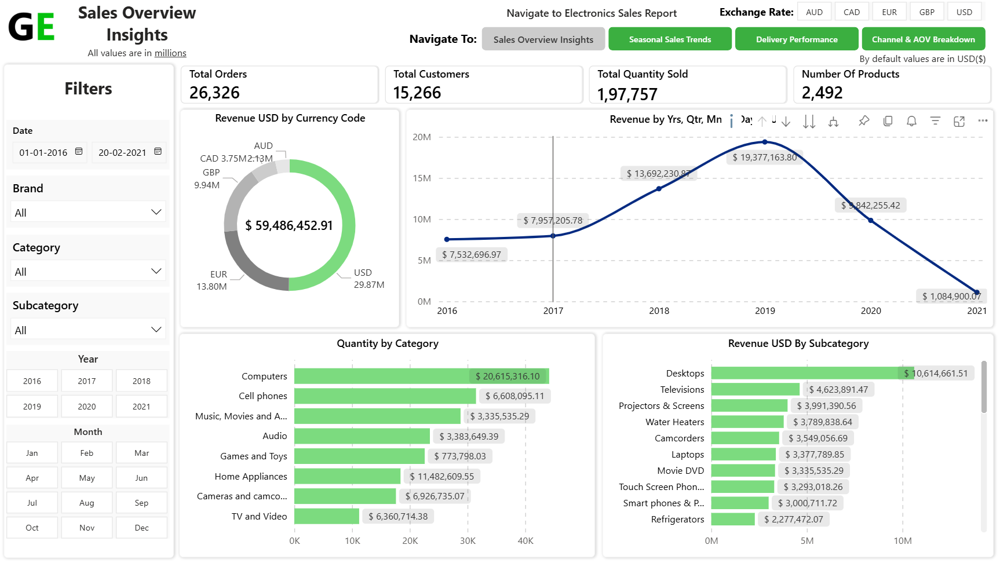
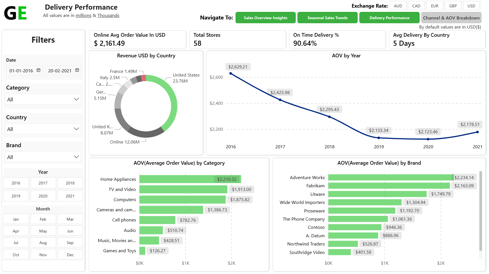
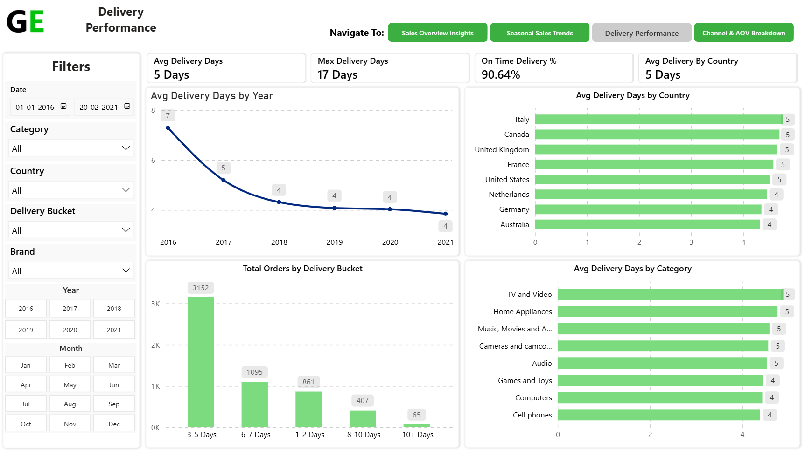
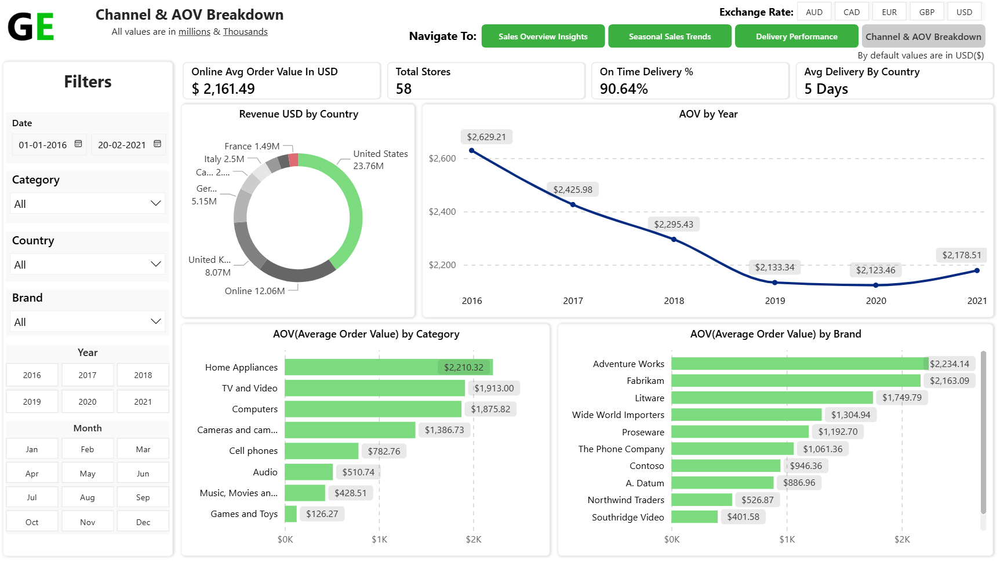

# Power BI Electronics Retail Sales Dashboard  

## 📊 Project Overview  
This repository showcases a Power BI Dashboard Project designed to analyze sales and delivery performance for an electronics retail business. The report provides key insights into sales trends, product category performance, and delivery metrics.
The PBIX file is not shared publicly to protect the dataset, but the screenshots below demonstrate the dashboard's design and analytical capabilities. 

---

## 🖼️ Dashboard Snapshots  

### Dashboard 1 – Sales Overview Insights Dashboard
  

### Dashboard 2 – Seasonal Sales Trends Dashboard 
  

### Dashboard 3 – Delivery Performance Dashboard  

### Dashboard 4 – Channel And AOV Breakdown Dashboard  

---

## ⚙️ Key Features  
- Core Sales Metrics: At-a-glance KPIs for total orders, customers, quantity sold, and revenue.
- Trend Analysis: Visualization of sales and quantity trends over time (yearly and monthly).
- Product Insights: Breakdown of revenue and quantity sold by category and subcategory.
- Delivery Tracking: Monitoring of key delivery metrics such as average delivery days and on-time delivery percentage.
- Geographic Performance: Analysis of revenue and average order value by country.
- Interactive Filters: Easily filter data by date, brand, category, and more.

---

## 🚀 Tech Stack  
- **Tool:** Power BI  
- **Data Source:** Excel (dummy dataset for practice)  
- **Language:** DAX for custom calculations and measures  

---

## 📬 Contact  
👤 **Aryan Dharmesh Patel**  
- 💼 Power BI Developer | Full Stack Developer  
- 🔗 [LinkedIn](www.linkedin.com/in/aryan-patel-ap02)
- 🔗 [Portfolio](https://www.datascienceportfol.io/aryan_dharmesh_patel)
- 📧 aryanpatelaryan81@gmail.com 
